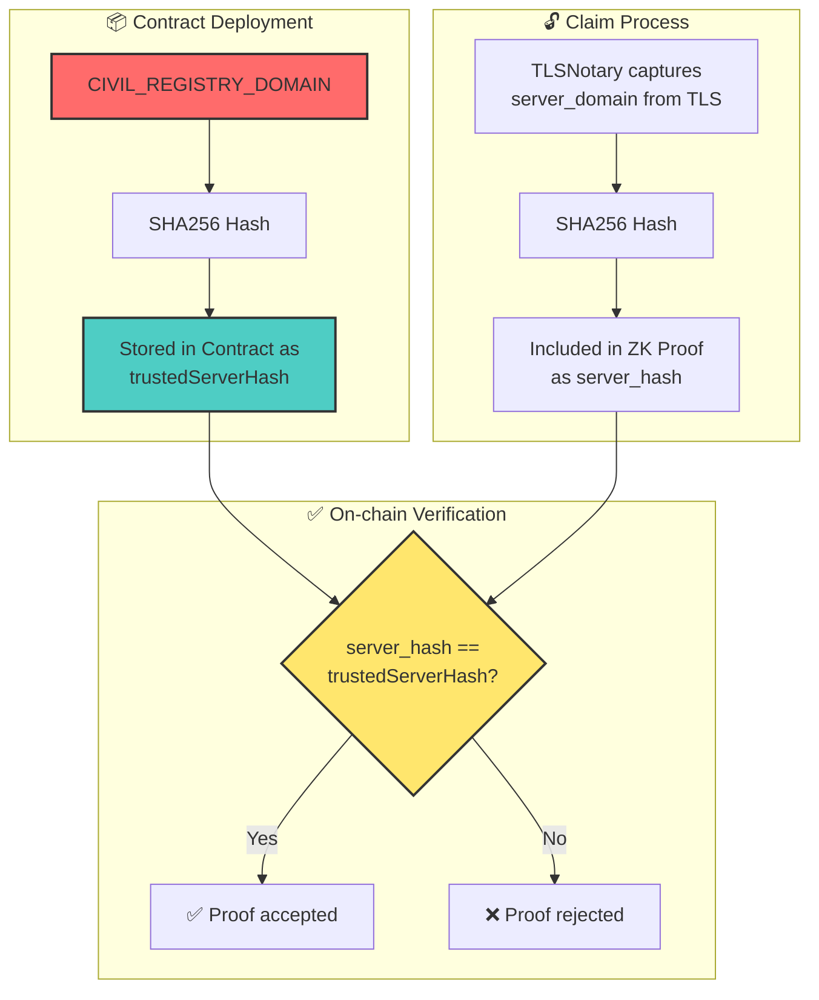

# 📜 ProofHeir

**ProofHeir** is a decentralized, privacy-preserving inheritance protocol built on [Mantle Network](https://www.mantle.xyz/). It enables automated digital asset transfers based on real-world web activity verification using **TLSNotary** and **Noir ZK proofs**, with seamless account abstraction via **EIP-7702**.

[](https://opensource.org/licenses/MIT)
[](https://www.mantle.xyz/)
[](https://noir-lang.org/)

---

## 🚀 The Vision

Traditional crypto inheritance relies on sharing private keys (insecure) or centralized custodians (defeats the purpose of crypto). **ProofHeir** creates a "Dead Man's Switch" that:

1. **Proves Inactivity:** Uses TLSNotary to verify the last time you logged into a web service (e.g., Civil Registry, Banking).
2. **Protects Privacy:** Uses Noir ZK-Proofs to prove inactivity without revealing your email or sensitive metadata.
3. **Executes Seamlessly:** Uses EIP-7702 to allow an EOA to delegate transfer power to the inheritance vault only when the proof is valid.

---

## 🛠 Tech Stack

| Layer | Technology |
| :--- | :--- |
| **Blockchain** | [Mantle Network](https://www.mantle.xyz/) (L2) |
| **Account Abstraction** | EIP-7702 (EOA Delegation) |
| **Web Attestation** | [TLSNotary](https://tlsnotary.org/) (Rust) |
| **ZK-Circuits** | [Noir](https://noir-lang.org/) |
| **Smart Contracts** | Solidity + [Foundry](https://book.getfoundry.sh/) |
| **Backend API** | Rust (Axum) |
| **Frontend** | Next.js 16 + Tailwind CSS + Viem |
| **Authentication** | [Privy](https://www.privy.io/) |
| **Monorepo** | [Nx](https://nx.dev/) + pnpm |

---

## 🏗 Project Structure

```text
proofheir/
├── apps/
│   ├── web/              # Next.js frontend (Dashboard & EIP-7702 signing)
│   ├── api/              # Rust Axum server (ZK Proof generation)
│   └── web-e2e/          # Playwright end-to-end tests
├── packages/
│   ├── circuits/         # Noir ZK-circuits (Inheritance conditions)
│   ├── contracts/        # Foundry (Vaults & ZK Verifiers)
│   └── notary/           # Shared Rust lib (TLSNotary + Prover logic)
├── nx.json               # Monorepo orchestration
├── Cargo.toml            # Rust Workspace root
├── render.yaml           # Render deployment configuration
└── dev.sh                # Development startup script
```

---

## ⚙️ How It Works

### 1. Proof of Life (Setup & Delegation)
The account owner establishes their "Proof of Life" by actively signing an **EIP-7702** delegation. This:
- Registers the inheritance rules on-chain
- Designates the heir's account
- Selects which tokens to include in inheritance
- Sets the inactivity threshold

### 2. Proof of Death (Execution)
To trigger inheritance, a valid "Proof of Death" is required:
1. **TLSNotary** verifies inactivity from a trusted data source
2. **Noir** generates a private ZK-proof of the inactivity
3. **ProofHeir Vault** validates the proof on-chain
4. Assets are automatically transferred to the heir

---

## 🔐 Architecture & Trust Model

The security of ProofHeir relies on cryptographic verification of data origin. Here's how data flows through the system:

```mermaid
sequenceDiagram
    participant Heir as 👤 Heir
    participant Frontend as 🌐 Frontend
    participant API as ⚙️ Rust API
    participant Registry as 🏛️ Civil Registry
    participant TLS as 🔒 TLSNotary
    participant Noir as 🟣 Noir Circuit
    participant Contract as 📜 ProofHeir Contract

    Note over Heir,Contract: CLAIM FLOW

    Heir->>Frontend: Request inheritance claim
    Frontend->>API: POST /api/generate-proof
    
    rect rgb(40, 40, 60)
        Note over API,TLS: TLSNotary Session
        API->>Registry: HTTPS request (status check)
        Registry-->>API: Encrypted response
        TLS->>TLS: Attest server identity & response
    end

    Note over API: Extract:<br/>- server_domain ✓<br/>- status: "No Vigente (Fallecido)"

    rect rgb(60, 40, 60)
        Note over API,Noir: ZK Proof Generation
        API->>Noir: Private inputs + commitments
        Noir->>Noir: Verify 4 constraints
        Noir-->>API: ZK Proof + public inputs
    end

    API-->>Frontend: proof, publicInputs
    Frontend->>Contract: claimInheritance(proof, inputs)
    
    rect rgb(40, 60, 40)
        Note over Contract: On-chain Verification
        Contract->>Contract: Verify ZK proof
        Contract->>Contract: Check server_hash matches trusted domain
        Contract->>Contract: Validate identity commitment
        Contract->>Contract: Transfer assets to heir
    end

    Contract-->>Heir: ✅ Inheritance received
```



### 🔑 Critical Security Variables

| Variable | Where Used | Purpose |
|:---------|:-----------|:--------|
| `CIVIL_REGISTRY_DOMAIN` | Contract Deploy | **Trusted server domain** - The SHA256 hash of this domain is stored in the contract. Proofs must originate from this exact server. |
| `server_hash` | ZK Circuit | SHA256 hash of the server that provided the death certificate. Must match the trusted domain. |
| `id_commitment` | ZK Circuit + Contract | SHA256(nuip + salt) - Links proof to specific heir without revealing ID |
| `status_commitment` | ZK Circuit | SHA256(status + blinder) - Proves status without revealing the exact value |

### Why `CIVIL_REGISTRY_DOMAIN` is Critical



> [!CAUTION]
> The `CIVIL_REGISTRY_DOMAIN` **must match exactly** the domain used during TLSNotary attestation. Any mismatch will cause proof verification to fail. This ensures proofs can ONLY come from the designated authoritative source.

### Data Flow Summary

| Step | Component | Input | Output | Trust Guarantee |
|:-----|:----------|:------|:-------|:----------------|
| 1 | **TLSNotary** | HTTPS session | Attested data + server cert | Data came from the server claimed |
| 2 | **Noir Circuit** | Private data + commitments | ZK proof | Computations are correct without revealing private data |
| 3 | **Smart Contract** | Proof + public inputs | Verification result | Only valid proofs from trusted sources are accepted |

---

## 🚀 Quick Start

### Prerequisites

- **Node.js** 18+ and **pnpm**
- **Rust** (nightly) and **Cargo**
- **Foundry** (for smart contracts)
- **Noir** (for ZK circuits)

### Installation

```bash
# Clone the repository
git clone https://github.com/LuisFelipe09/proofheir.git
cd proofheir

# Install dependencies
pnpm install

# Install Foundry (if not already installed)
curl -L https://foundry.paradigm.xyz | bash
foundryup

# Install Noir (if not already installed)
curl -L https://raw.githubusercontent.com/noir-lang/noirup/main/install | bash
noirup
```

### Environment Setup

```bash
# Copy environment template
cp .env.example .env

# Edit with your values
# - NEXT_PUBLIC_PRIVY_APP_ID: Your Privy application ID
# - SPONSOR_PRIVATE_KEY: Wallet for sponsoring delegations
# - Contract addresses after deployment
```

### Development

```bash
# Option 1: Automated (Recommended)
./dev.sh

# Option 2: Manual
# Terminal 1 - Rust API Server
cd apps/api && cargo run --release

# Terminal 2 - Next.js Frontend
pnpm dev:web
```

**Default URLs:**
- Frontend: http://localhost:3000
- Rust API: http://localhost:3001

---

## 📦 Smart Contracts

### Core Contracts

| Contract | Description |
| :--- | :--- |
| `ProofHeir.sol` | Main inheritance vault with ZK verification |
| `Verifier.sol` | UltraHonk ZK proof verifier (generated from Noir) |
| `MockERC20.sol` | Test token for development |

### Local Development

```bash
# Start local Anvil node
anvil

# Deploy contracts
cd packages/contracts
forge script script/DeployProofHeir.s.sol:DeployProofHeir \
  --rpc-url http://localhost:8545 \
  --private-key 0xac0974bec39a17e36ba4a6b4d238ff944bacb478cbed5efcae784d7bf4f2ff80 \
  --broadcast
```

### Testing Contracts

```bash
cd packages/contracts

# Run all tests
forge test

# Run with verbosity
forge test -vvv

# Gas report
forge test --gas-report
```

---

## 🚢 Deployment

### Infrastructure Overview

ProofHeir uses a multi-service architecture deployed across cloud providers:

| Service | Runtime | Provider |
| :--- | :--- | :--- |
| **Web App** | Next.js | Render |
| **Rust API** | Docker (Axum) | Render |
| **Smart Contracts** | Solidity | Mantle Network |

### Deploy to Render

The project includes a `render.yaml` blueprint for one-click deployment.

1. **Connect Repository:**
   - Go to [Render Dashboard](https://dashboard.render.com/)
   - Click "New" → "Blueprint"
   - Connect your GitHub repository
   - Render will auto-detect `render.yaml`

2. **Configure Environment Variables:**

   **For `proofheir-api` (Rust API):**
   | Variable | Description |
   | :--- | :--- |
   | `ALLOWED_ORIGIN` | Frontend URL (e.g., `https://proofheir-web.onrender.com`) |
   | `VERIFIER_PRIVATE_KEY` | Private key for proof verification transactions |
   | `RUST_LOG` | Log level (default: `proofheir_api=info`) |

   **For `proofheir-web` (Next.js):**
   | Variable | Description |
   | :--- | :--- |
   | `NEXT_PUBLIC_PRIVY_APP_ID` | Your Privy application ID |
   | `NEXT_PUBLIC_CHAIN_ID` | Chain ID (`5003` for Mantle Sepolia) |
   | `NEXT_PUBLIC_PROOF_HEIR_ADDRESS` | Deployed ProofHeir contract address |
   | `NEXT_PUBLIC_MOCK_TOKEN_ADDRESS` | Deployed MockERC20 address |
   | `RUST_API_URL` | Rust API URL (e.g., `https://proofheir-api.onrender.com`) |
   | `SPONSOR_PRIVATE_KEY` | Wallet private key for EIP-7702 delegations |
   | `UPSTASH_REDIS_REST_URL` | Redis URL for heir-testator registry |
   | `UPSTASH_REDIS_REST_TOKEN` | Redis authentication token |

3. **Deploy:**
   - Click "Apply" to deploy both services
   - Render will build and deploy automatically

### Deploy Smart Contracts

**Mantle Sepolia (Testnet) - Using Script:**

The easiest way to deploy to Mantle Sepolia is using the dedicated script:

```bash
cd packages/contracts

# Set your private key
export DEPLOYER_PRIVATE_KEY=0x...

# Run the deployment script
./script/deploy-mantle-sepolia.sh
```

> [!TIP]
> Get testnet MNT for gas from the [Mantle Sepolia Faucet](https://faucet.sepolia.mantle.xyz/)

The script will:
- Load configuration from `.env` if `DEPLOYER_PRIVATE_KEY` is not set
- Deploy ProofHeir, Verifier, and MockERC20 contracts
- Output contract addresses for your frontend configuration

**Mantle Sepolia - Manual:**

```bash
export PRIVATE_KEY=your_private_key_here
export RPC_URL=https://rpc.sepolia.mantle.xyz

cd packages/contracts
forge script script/DeployProofHeir.s.sol:DeployProofHeir \
  --rpc-url $RPC_URL \
  --private-key $PRIVATE_KEY \
  --broadcast \
  --legacy \
  -vvv
```

**Mantle Mainnet:**

```bash
export PRIVATE_KEY=your_private_key_here
export RPC_URL=https://rpc.mantle.xyz

cd packages/contracts
forge script script/DeployProofHeir.s.sol:DeployProofHeir \
  --rpc-url $RPC_URL \
  --private-key $PRIVATE_KEY \
  --broadcast \
  --verify \
  --slow
```

### Verify Contracts

```bash
forge verify-contract \
  --chain-id 5003 \
  --compiler-version v0.8.20 \
  <CONTRACT_ADDRESS> \
  src/ProofHeir.sol:ProofHeir
```

---

## 🧪 Testing

### Frontend E2E Tests

```bash
# Run Playwright tests
cd apps/web-e2e
npx playwright test
```

### API Health Check

```bash
# Local
curl http://localhost:3001/health

# Production
curl https://proofheir-api.onrender.com/health
```

### Generate Test Proof

```bash
curl -X POST http://localhost:3001/api/generate-proof \
  -H "Content-Type: application/json" \
  -d '{
    "recipient": "0x03f72d5859858AFF7b93096B4AD9593442DD2327",
    "nuip": "123456789",
    "salt": "0x1111111111111111111111111111111111111111111111111111111111111111"
  }'
```

---

## 🔐 Security Considerations

> [!CAUTION]
> **Never commit real private keys!** Use environment variables and secrets management.

- ⚠️ `MockVerifier.sol` is for **testing only** - never use in production
- ✅ Always use the real `Verifier.sol` generated from the Noir circuit
- 🔒 Verify contracts on block explorer after deployment
- 🛡️ Audit smart contracts before mainnet deployment
- 🔑 Use hardware wallets for production private keys

---

## 📚 Documentation

- [Development Guide](./DEV_GUIDE.md) - Detailed development setup
- [Configuration Guide](./CONFIG.md) - Environment configuration
- [Contracts README](./packages/contracts/README.md) - Smart contract details
- [Circuits README](./packages/circuits/README.md) - ZK circuit documentation

---

## 🤝 Contributing

Contributions are welcome! Please read our contributing guidelines and submit pull requests.

1. Fork the repository
2. Create your feature branch (`git checkout -b feature/amazing-feature`)
3. Commit your changes (`git commit -m 'Add amazing feature'`)
4. Push to the branch (`git push origin feature/amazing-feature`)
5. Open a Pull Request

---

## 📄 License

This project is licensed under the MIT License - see the [LICENSE](LICENSE) file for details.

---

## 🔗 Links

- **Website:** [Coming Soon]
- **Documentation:** [See above](#-documentation)
- **Mantle Network:** https://www.mantle.xyz/
- **TLSNotary:** https://tlsnotary.org/
- **Noir:** https://noir-lang.org/

---

<p align="center">
  Built with ❤️ for the future of digital inheritance
</p>
