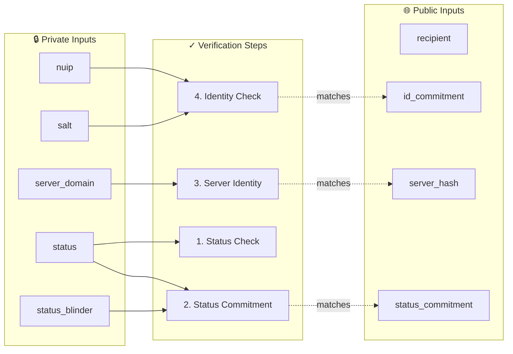

# ProofHeir Circuits

Noir ZK circuit for verifying death certificate proofs using SHA256 hashing.

## Circuit Overview

The circuit verifies that a person is deceased according to a government civil registry without revealing their identity. It performs four cryptographic checks:



### Verification Steps

| Step | Function | What it Verifies |
|:-----|:---------|:-----------------|
| **1. Status Check** | `check_status()` | Confirms status equals `"No Vigente (Fallecido)"` (Not Valid - Deceased) |
| **2. Status Commitment** | `check_status_commitment()` | Verifies `SHA256(status + blinder) == status_commitment` |
| **3. Server Identity** | `check_server_identity()` | Verifies `SHA256(server_domain) == server_hash` |
| **4. Identity Check** | `check_identity()` | Verifies `SHA256(nuip + salt) == id_commitment` |

### Privacy Guarantees

- ✅ **NUIP (ID number)** remains private - only the commitment is revealed
- ✅ **Salt** is derived from heir's email - links proof to specific heir
- ✅ **Server domain** verified but not exposed in public inputs
- ✅ **Status** verified but blinded with random blinder

## Prerequisites

```bash
# Install Noir compiler
curl -L https://raw.githubusercontent.com/noir-lang/noirup/main/install | bash
noirup -v 1.0.0-beta.8

# Install Barretenberg prover
curl -L https://raw.githubusercontent.com/AztecProtocol/aztec-packages/refs/heads/next/barretenberg/bbup/install | bash
bbup -v 1.0.0-nightly.20250723
```

> [!NOTE]
> Version compatibility is critical. These versions are tested to work together.

## Circuit Compilation & Testing

```bash
# Compile the circuit
nargo compile

# Run unit tests
nargo test
```

## Proof Generation

```bash
# 1. Execute circuit (generates witness)
nargo execute

# 2. Generate verification key
bb write_vk -b ./target/circuits.json -o ./target

# 3. Generate proof (clean up old proof file first if needed)
rm -f ./target/proof
bb prove --bytecode_path ./target/circuits.json --witness_path ./target/circuits.gz -o ./target

# 4. Verify proof locally
bb verify -k ./target/vk -p ./target/proof
```

> [!TIP]
> Use `--oracle_hash keccak` flag when generating VK and proofs for Solidity verifier compatibility.

## Solidity Verifier Generation

```bash
bb write_solidity_verifier -k ./target/vk -o ./target/Verifier.sol

# Copy to contracts package
cp ./target/Verifier.sol ../contracts/src/Verifier.sol
```

## Output Files

| File | Description |
|------|-------------|
| `target/circuits.json` | Compiled circuit (ACIR) |
| `target/circuits.gz` | Witness data |
| `target/vk` | Verification key |
| `target/proof` | ZK proof |
| `target/public_inputs` | Serialized public inputs |
| `target/Verifier.sol` | Solidity verifier contract |

## Public Inputs Format

The circuit expects 116 public inputs (each byte serialized as a 32-byte field element):

| Input | Size | Description |
|-------|------|-------------|
| `recipient` | 20 bytes | Ethereum address to prevent front-running |
| `server_hash` | 32 bytes | SHA256 hash of trusted server domain |
| `id_commitment` | 32 bytes | SHA256(nuip + salt) |
| `status_commitment` | 32 bytes | SHA256(status + blinder) |

## Configuration

Edit `Prover.toml` with your inputs before generating proofs.
